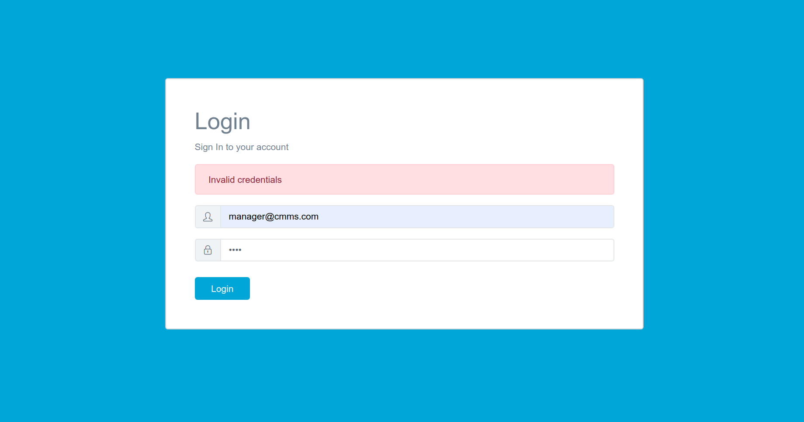
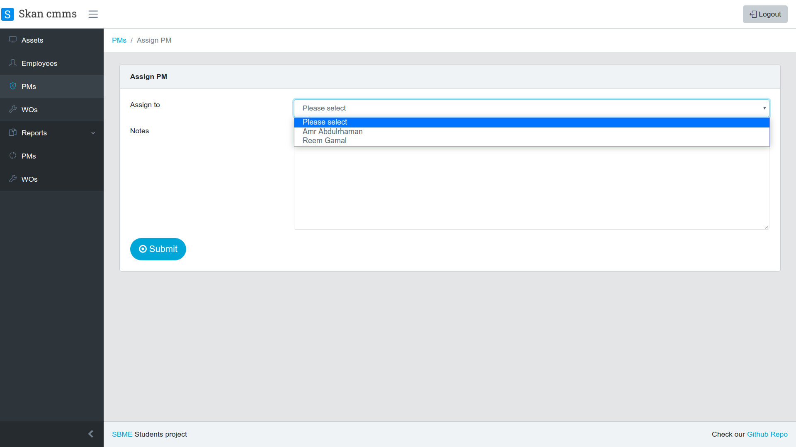

# web-based-cmms-system

Prototype implementation of a web-based CMMS system using MERN stack.

## Folder structure

For more info about folder structure click [here](https://stackoverflow.com/a/51128385).

## How to run

1. install dependancies:
   `npm install`

2. run server and client:
   `npm run dev`

### System flow overview

## Snapshots

### 1. Login page

- System users land on a login page, type their email and password.
- The email and password are provided to employees by the system manager.
- If there is any error, the form sends an error message.

  
  

### 2. Manager UI

#### 2.1 Assets

The manager can:

1. View all assets in the hospital.
2. Add a new asset information
3. View details of the asset
4. Delete an asset

 
    
<em>Fig. 2.1.1: Asset list</em>
 

 
 
    
<em>Fig. 2.1.2: Form for adding new asset</em>
 

 
 
    
<em>Fig. 2.1.3: Asset details</em>
 

#### 2.2 Employees

The manager can:

1. View all employees in the hospital.
2. Register a new employee
3. Delete an employee

 
 
    
<em>Fig. 2.2.1: Employees list</em>
 

 
 
    
<em>Fig. 2.2.1: Employee Registeration form</em>
 

#### 2.3 Preventive maintenance

The manager can:

1. List all preventive maintenance required for assets.
2. Add preventive maintenance required for an asset when registering it.
3. View the instructions of a PM.
4. Delete a PM.

 
 
    
<em>Fig. 2.3.1: Preventive maintenance list</em>
 

 
 
    
<em>Fig. 2.3.2: Add PM</em>
 

 
 
    
<em>Fig. 2.3.3: Instructions of a PM</em>
 

#### 2.4 Work Orders

The manager can:

1. List all work orders for assets.
2. View the instructions of a work order.

 
 
    
<em>Fig. 2.4.1: Work orders list</em>
 

 
 
    
<em>Fig. 2.4.2: Instructions of a WO</em>
 

#### 2.5 Reports

The manager can view all PM and WO reports. //CHECK

 
 
    
<em>Fig. 2.5.1: Work orders reports list</em>
 

 
 
    
<em>Fig. 2.5.2: Details of a report</em>
 

### 3. Department Supervisor UI

#### 3.1 Assets

Supervisor of a department can:

1. View all assets in his department.
2. View details of department assets.

 
 
    
<em>Fig. 3.1.1: Department Assets</em>
 

#### 3.2 Employees

Supervisor can list employees in his department.

 
 
    
<em>Fig. 3.2.1: Department Employees</em>
 

#### 3.3 Preventive maintenance

Supervisor of a department can:

1. View all preventive maintenance required in his department.
2. View details of a specfic PM.
3. Assign PM work to a technician in his department

 
 
    
<em>Fig. 3.3.1: Department Required PMs</em>
 

 
 
    
<em>Fig. 3.3.1: Assign PM work</em>
 

#### 3.4 Work Orders

The supervisor can:

1. List all work orders in his department.
2. Create a new work order and assign it to a technican.

 
 
    
<em>Fig. 3.4.1: List of of department workorders</em>
 

 
 
    
<em>Fig. 3.4.1: Create work order form</em>
 

#### 3.5 Reports

The manager can view all department PM and WO reports.

### 4. Technician

#### 4.1 Assets

Technican can:

1. View all assets in his department.
2. View details of department assets.

#### 4.2 Preventive maintenance

Technican can:

1. View preventive maintenance work assigned to him.
2. View details of a specfic PM that is assigned to him.
3. Write a report about the work assigned to him.

 
 
    
<em>Fig. 4.2.1: PMs list </em>
 

 
 
    
<em>Fig. 4.2.2: Return report form </em>
 

#### 4.3 Work Orders

1. View work orders assigned to him.
2. View details of a specfic WO that is assigned to him.
3. Write a report about the work assigned to him.

 
 
    
<em>Fig. 4.3.1: WOs list </em>
 

 
 
    
<em>Fig. 4.3.2: Return report form </em>
 

